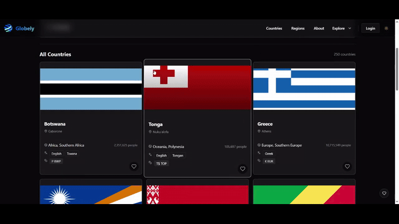

# Globely

**Deployed App:** [https://manilkanavod.me](https://manilkanavod.me)

A full-stack web application built with React.js and Express.js. [Add a brief one-line description of what your application does]

## 📋 Table of Contents

- [Features](#features)
- [Demo](#demo)
- [Tech Stack](#tech-stack)
- [Getting Started](#getting-started)
  - [Prerequisites](#prerequisites)
  - [Installation](#installation)
- [Project Structure](#project-structure)
- [API Documentation](#api-documentation)
- [Environment Variables](#environment-variables)
- [Build & Deployment](#build--deployment)
- [Usage](#usage)
- [Development Challenges](#development-challenges)
- [API Selection](#api-selection)
- [Future Improvements](#future-improvements)
- [Contributing](#contributing)
- [License](#license)
- [Contact](#contact)

## ✨ Features

- Bookmarking Favorite Countries
- Live Map Search

## 🚀 Demo



## 💻 Tech Stack

### Frontend

- React.js
- Component-based architecture with dedicated UI and common components
- Redux Toolkit and RTK Query for state management and API calls
- Context API for local state management
- Custom hooks for reusable logic
- React Router for navigation
- Feature-based organization for scalability

### Backend

- Node.js
- Express.js
- Database - MongoDB
- Authentication - JWT

### External APIs

- [REST Countries API](https://restcountries.com/) - Provides country data and information

## 🚦 Getting Started

### Prerequisites

- Node.js (v14.x or higher)
- npm (v6.x or higher) or yarn (v1.22.x or higher)
- Docker (Optional)

### Installation

1. Clone the repository:

   ```bash
   git clone https://github.com/SE1020-IT2070-OOP-DSA-25/af-2-IT22000644
   cd your-repo-name
   ```

2. Install dependencies for both frontend and backend:

   ```bash
   # Install backend dependencies
   cd server
   npm install

   # Install frontend dependencies
   cd ../frontend
   npm install
   ```

3. Set up environment variables:

   ```bash
   # In the server directory
   cp .env.example .env
   ```

   Edit the `.env` file with your configuration (see [Environment Variables](#environment-variables) section)

4. Start the development servers:

   ```bash
   # Start backend server (from server directory)
   npm run dev

   # In a new terminal, start frontend (from client directory)
   npm start
   ```

## 📁 Project Structure

```
Globely/
├── frontend/                       # React frontend
│   ├── node_modules/               # Frontend dependencies
│   ├── public/                     # Static files
│   ├── src/
│   │   ├── api/                    # API integration
│   │   ├── app/                    # App-specific components
│   │   ├── assets/                 # Images, fonts, etc.
│   │   ├── components/             # Reusable components
│   │   │   ├── common/             # Shared components
│   │   │   └── ui/                 # UI components
│   │   ├── context/                # React context providers
│   │   ├── features/               # Feature-specific components
│   │   ├── hooks/                  # Custom React hooks
│   │   ├── layouts/                # Layout components
│   │   ├── lib/                    # Library code and utilities
│   │   ├── pages/                  # Page components
│   │   ├── routes/                 # Route definitions
│   │   ├── tests/                  # Test files
│   │   ├── utils/                  # Utility functions
│   │   ├── App.jsx                 # Main component
│   │   ├── index.css               # Global CSS
│   │   └── main.jsx                # Entry point
│   ├── .env                        # Environment variables
│   └── .gitignore                  # Git ignore file
│
├── backend/                        # Express backend
│   ├── node_modules/               # Backend dependencies
│   ├── src/
│   │   ├── config/                 # Configuration files
│   │   ├── controllers/            # Route controllers
│   │   ├── middleware/             # Custom middleware
│   │   ├── models/                 # Data models
│   │   ├── routes/                 # API routes
│   │   └── utils/                  # Utility functions
│   ├── .env                        # Environment variables
│   ├── .env.sample                 # Example environment variables
│   ├── compose.yaml                # Docker Compose configuration
│   ├── Dockerfile                  # Docker configuration
│   ├── server.js                   # Server entry point
│   ├── package.json                # Backend dependencies
│   └── package-lock.json           # Dependency lock file
│
├── .gitignore                      # Git ignore file
├── LICENSE                         # License file
└── README.md                       # This file
```

## 📚 API Documentation

### External API: REST Countries

This application utilizes the REST Countries API (https://restcountries.com/v3.1/) to fetch country data. The following endpoints are implemented through Redux Toolkit Query:

#### Country Endpoints

- `GET /all` - Get all countries
  - Optional query: `fields` to specify required fields
- `GET /independent?status={true|false}` - Get countries by independence status
- `GET /name/{name}` - Search countries by name
- `GET /name/{name}?fullText=true` - Get country by exact name match
- `GET /alpha/{code}` - Get country by country code
- `GET /alpha?codes={code},{code},...` - Get multiple countries by country codes

#### Filter Endpoints

- `GET /currency/{currency}` - Get countries by currency
- `GET /demonym/{demonym}` - Get countries by demonym
- `GET /lang/{language}` - Get countries by language
- `GET /capital/{capital}` - Get countries by capital city
- `GET /region/{region}` - Get countries by region
- `GET /subregion/{subregion}` - Get countries by subregion
- `GET /translation/{translation}` - Get countries by translation

### Backend API

#### Base URL

- Development: `http://localhost:5000/api`
- Production: `https://manilkanavod.me/api`

#### Endpoints

- `POST /users/register` - Create new User
- `POST /users/login` - Authenticate registered Users
- `GET /users/me` - Get requested User's information
- `POST /users/favorites` - Add country to the favorites list
- `GET /users/favorites` - Get the list of favorite countries
- `DELETE /users/{cca3}` - Delete the country with given cca3 from favorites

## 🔐 Environment Variables

### Backend (.env)

```
NODE_ENV=development
PORT=5000
MONGODB_URI=mongodb://localhost:27017/your-database
JWT_SECRET=your_jwt_secret
```

### Frontend (.env)

```
REACT_APP_API_URL=http://localhost:5000/api
```

## 🔨 Build & Deployment

### Build for Production

```bash
# Build the frontend
cd client
npm run build

# The build files will be in the client/build directory
```

### Deployment Options

#### Option 1: Traditional Deployment

1. Deploy the Express backend to a server (Heroku, DigitalOcean, AWS, etc.)
2. Deploy the React frontend build to a static hosting service or the same server

#### Option 2: Containerized Deployment

```bash
# Build Docker image
docker build -t your-app-name .

# Run Docker container
docker run -p 8080:8080 your-app-name
```

## 🧩 Development Challenges

During the development of this project, we encountered several challenges:

1. **[Challenge 1]**:

   - Problem: Heavy request load in the Countries REST API leading to momentary server crashes.
   - Solution: Developed and tested the application during off peak hours during which the system load is minimum

2. **[Challenge 2]**:

   - Problem: Countries REST API having no paginated requests
   - Solution: Handled the pagination logic in the frontend web application to make it more user friendly

## 📡 API Selection

We selected the following API for this project:

1. **REST Countries API (https://restcountries.com/)**
   - Purpose: Provides comprehensive data about countries including basic information, demographics, geography, currencies, languages, and more
   - Why chosen:
     - Free to use with no API key required
     - Well-documented with consistent response structure
     - Offers multiple filtering options (by region, language, currency, etc.)
     - Provides rich data for each country including flags, maps, population, and more
     - Regular updates to maintain data accuracy
   - Integration Method: Used Redux Toolkit Query to create a organized API client with caching capabilities

## 📞 Contact

[Manilka Navod Dikkumbura] - [manilkadikkumbura17@gmail.com]

Project Link: [https://github.com/IT22000644/Globely](https://github.com/IT22000644/Globely)
